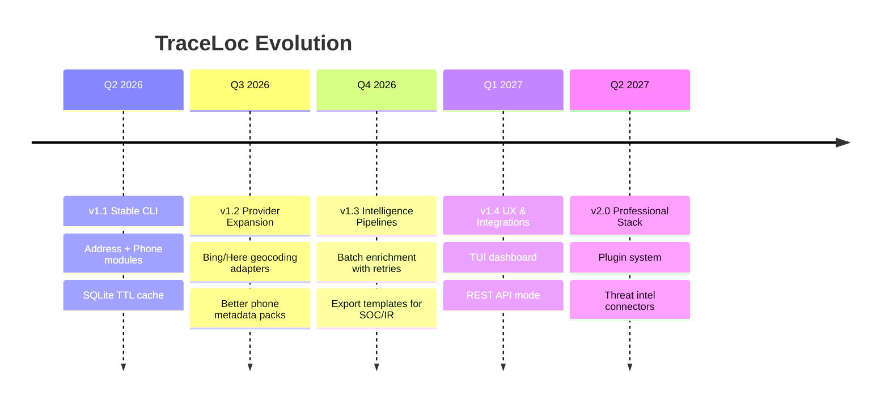

# 🗺️ TraceLoc Roadmap Visual

## Milestones (visual)

- 🟢 **Concluído (v1.1):** Base operacional e resiliente.
- 🟡 **Em andamento (v1.2):** Mais provedores e qualidade de dados.
- 🔵 **Planejado (v1.3+):** Pipelines, UX e integrações enterprise.
